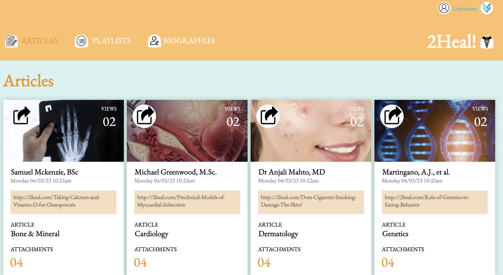

# Static Comp

## Abstract: 
I used HTML and CSS to create a static site based on a static comp outlined in https://frontend.turing.edu/projects/M2-static-comp-challenge.html. My webpage mimics the general layout of the comp while displaying my own creativity with styling. I have chosen each box to represent a category in the medical field, and mentions the article that the author wrote in the specific category. The site can be viewed at https://soy-park.github.io/static-medical-comp/

## Preview of Comp: 

## Context: 
This comp was generated during week 3 of module 2 of Turing School of Software and Design. (Each module is 6 weeks long.) It took me about 10 hours to complete the comp.

## Contributors:
Soyeon Park [@soy-park](https://github.com/soy-park)

## Learning Goals:
- Practice working out the HTML/CSS muscle

## Wins: 
- Following the general design of the original comp
- Using flexbox 
- Adding my own spin to the comp by focusing on the medical field

## Challenges: 
- Staying patient with incorporating the details that are displayed on the comp